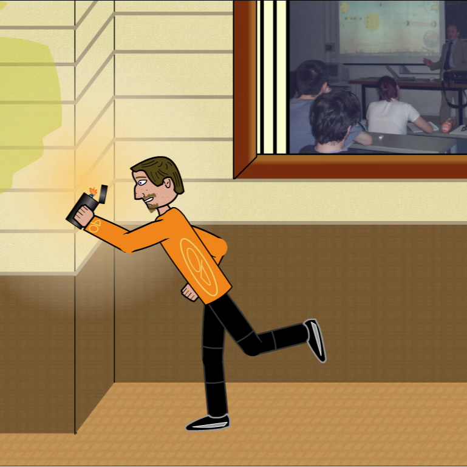

# Dookie College - Animação Flash (2005)
by Francisco Mat
Made in 2005

Animação criada para o clipe da música College (composta por Luiz), sobre um estudante que não gostava da faculdade e dos professores. Numa levada punk a música é uma crítica e fala sobre a frustração pela qual muitos estudantes passam presos nas salas de aula.

A música tem uma levada punk e pensei o que melhor do que botar fogo no prédio inteiro, com o professor dando aula? Montei a animação onde um estudante protagonizava a cena, ele sai durante a aula na faculdade para por fogo no prédio que o professor dava aula.

Mostrei a animação para banda e eles gostaram tanto que colocaram no clipe. Sempre usando o bom humor, na cena final o temido professor acaba de um jeito muito engraçado!

Foram realmente meses de trabalho e quase todo perdido, foi recuperado após anos utilizando um software chamado Photo Recovery do linux, que encontrou o arquivo original da animação quase dez anos depois, quase não acreditei, pois entre muitos outros trabalhos que foram apagados pela minha mãe quando mandou formatar meu computador sem meu consentimento, este foi um dos raros que consegui recuperar.

Assim ficou esperando algum tempo para poder ser "refeito", atualizado e preparado para o youtube, com apenas a modificação de constar meu nome Francisco Mat no vídeo, o resto é original e, digo, com trechos incompreendido até mesmo por mim.

Entregas:

    Animação em formato de vídeo

Curiosidade:

    Utilizei arquivos e personagens de um jogo que eu estava criando nessa época, muitas das animações, como o movimento de andar e socar, já estavam prontas, só adaptei para o clipe.
    Nesse jogo eu era o personagem principal, então consequentemente também protagonizo as animações.
    O professor e alunos que aparece, na animação não foram inspiradso em nenhuma pessoa conhecida, ou foram.

* Made in Windows XP + Flash MX.

Francisco Matelli Matulovic - 2005 - 2018